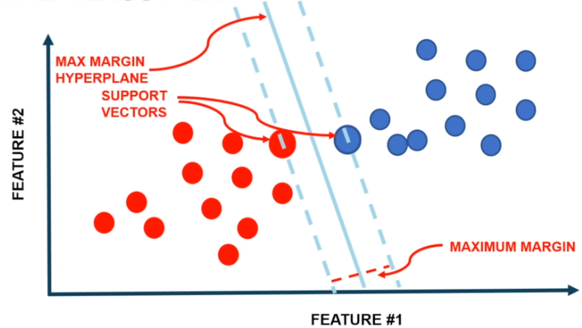
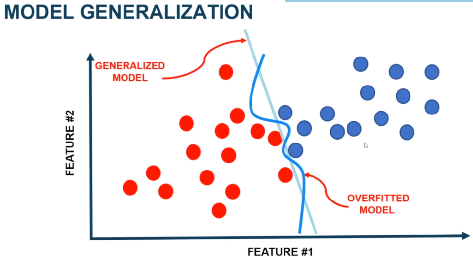
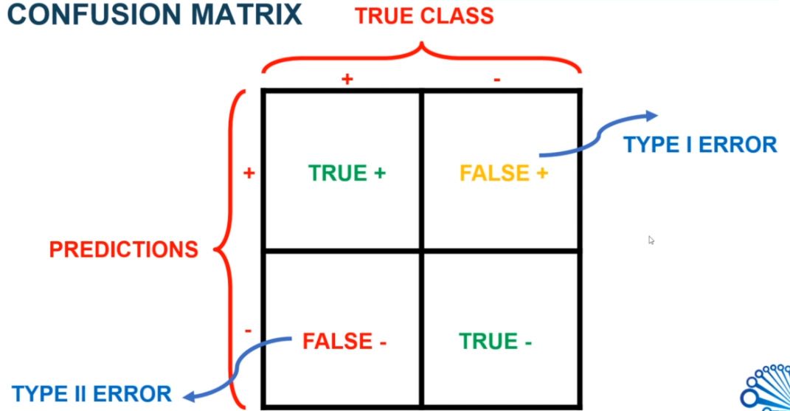
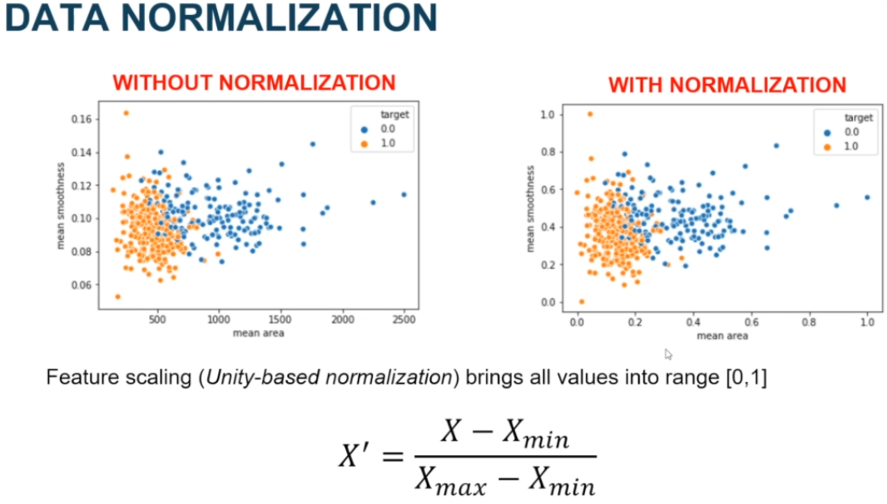
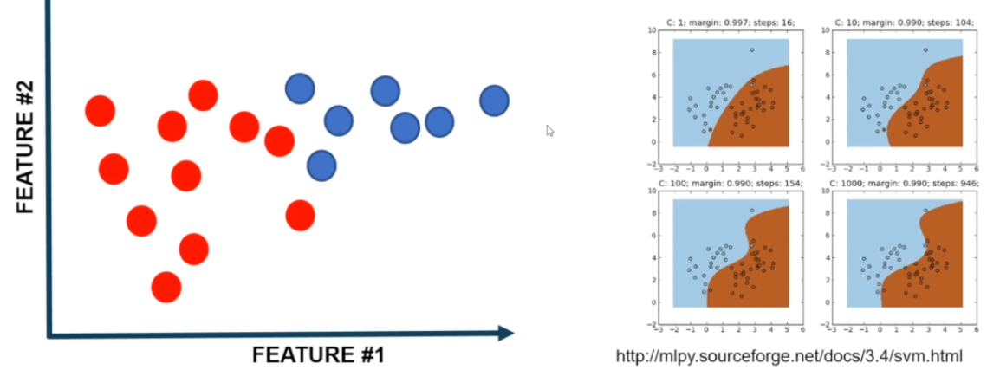
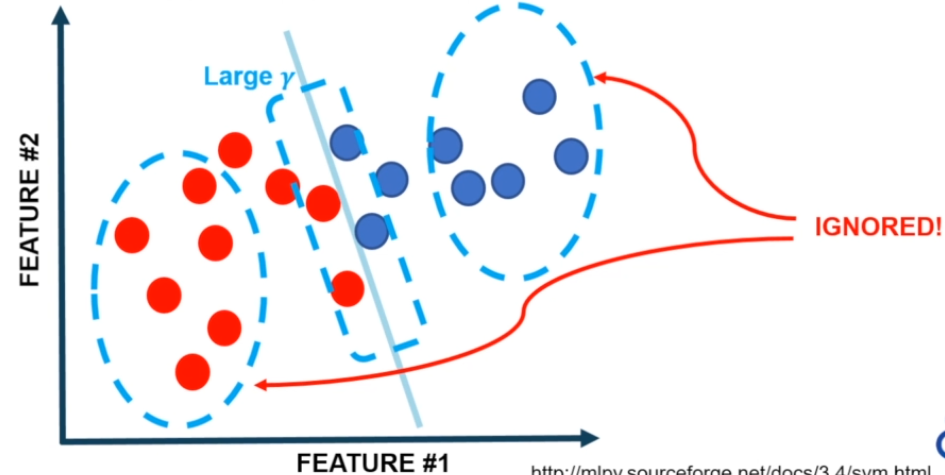
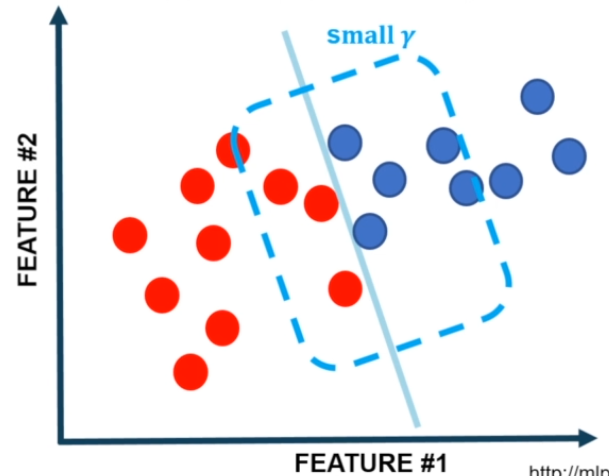

# 1. Introduction
- IntroPractical Case Studies
-  PhD Engineering

#  2. Business Challenge (ML: Breast Cancer Classification using SVM )
## BC
- Breast cancer affecte 2.1 million people
- Most common cancer among woman
- Early diagnosis increases the chances of survival
- Most experience physicias can diagnose cancer with 79% accurancy
- While ML up to 91%(up to 97%) accuracy
- Classify tummors into benign or malignant

## Cancer Diagnosis Procedure
1. __Fine Needle Aspirate (FNA):__ This process extracts cells out of the tumor.
2. __Tumor Images:__ Creation of images from the FNA.
3. __Features:__ Characteristics out of the image.
	 - Radius
	 - Texture
	 - Perimeter
	 - Area
	 - Smoothness
4. __ML Algorithm:__ Feed the features into a ML model in a way that calculates the classification.
5. __Classification:__ We obtain a classifcation without human interaction.

# 3. Updates on Udemy Reviews
Done

# 4. Challenge in Machine Learning Vocabulary
## Vocabulary

![Vocabulary]4_1.png)

- __Input:__ All features extracted from the features
- __Classifier:__ Machine learning model
- __Dataset:__ All features of the instances.
- __Target:__ For this case it will be a classifier
- __Class:__ There will be two types of classes:
	- Malignant (0)
	- Benign (1)

## Support Vector Machine Classifier

![Support Vector Machine Classifier]4_2.png)

For this case, lets assume: 
- _blue dots_ are _malignant_ 
- _red dots_ are _benign_
### What we do? 
- We want the algorithm to separate the two classes using the _SVM_. This algorithm finds the best line that separates the classes.
- We take the most close dots of each class on the boundary, and call it _Support Vectors_. This are commonly the features that mostly confuses the classes.
- The line between those vectors is called _Max Margin Hyperplane_
- The Max Margin is the max distance between the two classes.

# 5. Visualization of the Data

For this part we will be focussing on the Jupyter Notebook __Breast Cancer Classification Dataset - Filming__

# 6. Model Training

For this part we will be focussing on the Jupyter Notebook __Breast Cancer Classification Dataset - Filming__

# 7. Model Evaluation

For this part, we will be foccusing on the testing reality so we will expose the model to data it has not seen.

The key element is to used data we have not used for trainning, thats why we will be using testing data. And that is how we will evaluate our model

## Model Generalization
- We want the model to be general
- To basically move all images looking foward even if the images have not seen before
- Thats why we are looking for a _generalized model_
- If we expose the generalized model to new data, this new one might work better than the overfitted model.
- We want our model to be as generalized as posible.

## How can we evaluate our model?
 
To evaluate our model we use the _Confusion Matrix_.

__Terms__

- __Condition Positive (P):__ the number of real positive cases in the data.
- __Condition Negative (N):__ the number of real negative cases in the data.

- __True Class (Cols):__ Determinates the instances in actual class.
- __Predictions (Rows):__ The predictions are the algorithm results or the true value of our class.
- __True Positive (+):__ A true positive is an outcome where the model correctly predicts the positive class.
- __True Negative (-):__ Similarly, a true negative is an outcome where the model correctly predicts the negative class
- __False Positive (+):__ A false positive is an outcome where the model incorrectly predicts the positive class. 
- __False Negative:__ And a false negative is an outcome where the model incorrectly predicts the negative class, this is a total misclassified example.

- __Type I Error:__ Indicates that the prediction the patient has a disease, but in the real case he didn't.
- __Type II Error:__  This is a big problem and should be avoided, this means that the algorithm predicted the patient is fine but in real life he doesn't.

### Classification Accurancy

__Accuracy__ is one metric for evaluating classification models. Informally, accuracy is the fraction of predictions our model got right. Formally, accuracy has the following definition: 

$$A = \frac{Number of correct predictions}{Total number of predictions}$$

For binary classification, accuracy can also be calculated in terms of positives and negatives as follows:

$$A = \frac{TP + TN}{TP + TN + FP + FN}$$

# 8. Improving the Model

How can we improve the model?

## Data Normalization

The first thing to do is normalize the model, this is used by _unity based normalization_. This brings all values into range [0,1].

This is done using the formula feature scalling of _min max normalization_.

$$z_i=\frac{x_i-\min(x)}{\max(x)-\min(x)}$$

## SVM Parameters Optimization

* __C Parameter:__ Controls trade-off between classyfying trainning points correctly and having a smooth decision boundary. The idea is used a parameter that can penalyze the model if gets wrong(its like the cool teacher)
	* __Small C (loose):__ makes cost (penalty) of misclassificatin low (soft margin)
	* __Large C (strinct):__ makes cost misclassification high (hard margin), forcing the model to explain input data stricter and potentially overfit.

* __Gamma Parameter:__ control how far the influence of a single trainning set reaches.
	* __Large Gamma:__ close reach (closer data points have high weight)
	* __Small Gamma:__ far reach (more generalized solution)

## How to optimize parameters?

The fist improvement is normalization, then we will turn on the Gamma parameter and C parameter

# 9. Conclussion

- Machine Learning techniques (SVM) was able to classify tummos into Malignant/Benign with 95% acurracy.
- The technique can rapidly evaluate breast masses and classify them in an automated fashion.
- Early breast cancer can dramatically save livs epecially in the developing world.
- The technique can be further improved by combinig Computer Vision/ML techniques to directly classify cancer using tissue images.
