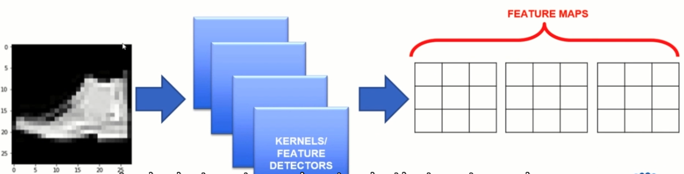

# 1. Business Intelligence

The Global Fashion is valued at 3 trillion dollars and accounts for 2% of the world's GDP. The GDP is undergoing a dramatic transformation by adopting new _Machine Learning_ and _Computer Vision_ techniques.

For this scenario, we assume if a retailer hired us to build a virtual stylist assistan that looks at customer Instagram profiles and classifies what fashion categories ther are wearing either bags, dresses and pants. The virtual assistant can help the stylist detect and forecast, fashion trends.

* Use Fashion Mnest data(bags, shoes and dresses)
* Classify the images into 10 classes

## 1. Bussines Case
- app or mdoel that can look images and determinate the category of an image
- we want to tell us that this is a short, this is a bag this is certain obtject.
- it will classify images in diferent categories
- Once the model has determinate what kind of categories uses certain user, the algorithm will target different objects equals to the ones the person is using.

One example is _Amazon Echo Look Style Assistant_

# 2. Challenge in Machine Learning Vocabulary

## Data Set in Machine Learning Terms

### Objective 
- Build a classifier that tell us what categories that certain clothe belongs to.

__For example:__

## Basic Review: What is an Image?

- All images will be represented in a binary format
-  

## Our Fashion Dataset
- Fashion dataset contains 28x28 greyscale image with values ranging from 0-255.
- 0: represents black
- 255: represents white
- each image is represented by a row with 784 (28x28) values.

For this case each row of the dataset is an image

# 3. Data Visualisation

Coding exercise, open the notebooks.

# 4. Model Training Part I

## Artificial Neural Network Basics
- The neuron collects signals from input channels named dentrites, processes information using in its nucleus, and then generates an output in a long thin branch called the axon.
- Human learnig occurs adaptively by varying the bond strength between these neurons

## Artificial Neural Network
Is a representation of a neuron, in a mathematical way it can be represented like this:

In a computational way it can be represented with this figure:

The overall idea is to change the values or weights of the artificial neural net.

## Convolutional Neural Network - Overview

The idea is take the images and used as an input directly on the network.
- When we deal with images, we need to preserve and call in the spatial dependence between pixels.
- For this type of cases, we need a convolutional wher the term convolutional neural network came into.
- First we will run a convolutional layer.

# 5. Model Training Part II

## CNN - Feature Detector

- __Convolutions__ use a kernel matrix to scan a fiven image and apply a filter ot obtain a certain effect.
- An __image Kenel__ is a matrix used to apply effects such as blurring and sharpening.
- __Kernels__ are used in machine learning for _features extraction_ to select most inportan pixels of an image.
-Convolution preservves the spatial relationship between pixels
- __Feature maps__ chacteristics out of feature detectors

For example: 

and we keep doing this until the kernel has iterate the whole image creating a new feature map.
 

For more info in: [setosa](setosa.io/ev/image-kernel/).

# 6. Model Training Part III

Next step is do a RELU activation function.
- RELU layers are used to add non-linearty in the feature map
- It also enhances the sparsity or how scattered the feature map is.
- The gradient of the RELU does not vanish as we increase x compared to the sigmoid function.

RELU in detail: The escence of this is try to make the image as sparse as posible, so we don't have valley in the image so the features pop up.

## CNN - Maxpooling/Flattening

- Pooling or downsampling layers are aplaced after convolutional layers to __reduce feature map dimensionality__.
- This improves thhe computatioal efficiency while preserving the features.
- Pooling helps the model to generalize by avoiding overftting. If one of the pixel is shifted, the pooled feature map will still be the same.
- Max pooling works by retaining the __maximum feautre repesponse__ within a given sample size in a feature map
- Live illustration: [http://scs.ryerson.ca/~aharley/vis/conv/flat.html](http://scs.ryerson.ca/~aharley/vis/conv/flat.html)

What we did?
- We reduce the feature map dimensionality.
- We preserve the feature in a condense form.
- The model gets to generalize an object.

Then we apply some flattening.

# 7. Model Training Part IV

Coding exercise, open the notebooks.

# 8. Model Evaluation

Coding exercise, open the notebooks.

# 9. Improving the Model

# 10. Conclusion